# Ideation Plugin

Transform brain dumps into structured implementation artifacts: contracts and implementation specs. Includes execution workflow for implementing specs in fresh sessions with per-component feedback loops.

## Skills

### ideation

Transforms raw, unstructured brain dumps (dictated freestyle) into actionable implementation artifacts through a confidence-gated workflow.

Use this when you have messy ideas, scattered thoughts, or dictated stream-of-consciousness, or when you want to plan a feature, spec something out, or turn rough ideas into actionable specs.

**How to invoke:**

```
Use the ideation skill

[provide your brain dump - messy dictation, scattered thoughts, half-formed ideas]
```

Or simply start with your brain dump and mention you want to turn it into specs:

```
I want to build something. Here's what I'm thinking...

[your raw, unstructured thoughts]

...can you help me turn this into a spec?
```

**The workflow:**

1. **Intake** - Accept your messy, unstructured input without judgment
2. **Anti-sycophancy challenge** - Take a position on the brain dump, challenge vague demand signals, flag undefined terms and hypothetical users
3. **Codebase exploration** - Understand existing code patterns, architecture, and conventions
4. **Confidence scoring** - Assess understanding across 5 dimensions (0-100), scoring conservatively when pushback reveals gaps
5. **Clarifying questions** - If confidence <95%, ask targeted questions via `AskUserQuestion`
6. **Contract** - When ≥95% confident, write `contract.md` (with revision lineage tracking via `Supersedes` field)
7. **Phasing & specs** - Determine phases, generate specs with feedback loops and failure mode catalogs
8. **Feedback quality check** - Self-review specs for feedback loop coverage before presenting
9. **Execution handoff** - Analyze orchestration strategy, write execution plan to contract, present summary

**Output artifacts:**

All artifacts are written to `./docs/ideation/{project-name}/`:

```
contract.md                    # Problem, goals, success criteria, scope, execution plan (with Supersedes lineage)
prd-phase-1.md                 # Phase 1 requirements (only if PRDs chosen)
spec-phase-1.md                # Phase 1 implementation spec (with failure modes)
spec-template-{pattern}.md     # Shared template for repeatable phases (if applicable)
spec-phase-N.md                # Per-phase delta or full spec
```

**Bundled references:**

- `contract-template.md` - Lean contract structure
- `prd-template.md` - Phased PRD template
- `spec-template.md` - Implementation spec template (includes feedback loops and failure modes)
- `confidence-rubric.md` - Scoring criteria for confidence assessment and spec feedback quality
- `feedback-loop-guide.md` - Component-type mapping and design criteria for feedback loops

## Anti-Sycophancy

The skill challenges weak premises rather than accepting them. During intake and contract formation:

- **Banned phrases**: "That's an interesting approach", "There are many ways to think about this", "That could work" — replaced with direct positions
- **Required behaviors**: Challenge vague demand, name undefined terms, flag hypothetical users, score conservatively when pushback reveals gaps

## Failure Modes

Specs now include a **Failure Modes** section that catalogs how each non-trivial component can fail:

| Column       | Purpose                          |
| ------------ | -------------------------------- |
| Component    | Which component                  |
| Failure Mode | Named failure (not just "error") |
| Trigger      | What causes it                   |
| Impact       | What happens to user/system      |
| Mitigation   | How to handle or acknowledge     |

Trivial components (config, types, constants) skip failure mode enumeration — same rule as feedback loops.

## Contract Lineage

Contracts track revision history via a `Supersedes` field. When re-running ideation on the same project, the prior contract is renamed to `contract-{date}.md` and the new contract references it, creating a traceable revision chain.

## Confidence Scoring

The skill scores your brain dump across 5 dimensions (20 points each):

| Dimension        | Question                                    |
| ---------------- | ------------------------------------------- |
| Problem Clarity  | Do I understand what problem we're solving? |
| Goal Definition  | Are the goals specific and measurable?      |
| Success Criteria | Can I write tests for "done"?               |
| Scope Boundaries | Do I know what's in and out of scope?       |
| Consistency      | Are there contradictions to resolve?        |

**Thresholds:**

- < 70: Major gaps - 5+ clarifying questions
- 70-84: Moderate gaps - 3-5 questions
- 85-94: Minor gaps - 1-2 questions
- ≥ 95: Ready to generate contract

Scoring is deliberately conservative — when uncertain between two levels, score lower. One extra question costs minutes; a bad contract costs hours.

## Feedback Loops

Specs now include per-component feedback loops so the executing agent validates its work _during_ implementation, not just after.

Each spec defines a **Feedback Strategy** (top-level inner-loop command and playground type), and each iterative component gets:

- **Playground** - Environment to interact with (test suite, dev server, storybook, script harness)
- **Experiment** - Parameterized check with specific inputs and edge cases
- **Check command** - Fastest single validation, runs in seconds

Component types map to feedback mechanisms:

| Component Type         | Feedback Mechanism         |
| ---------------------- | -------------------------- |
| Data/logic layers      | Test file                  |
| UI components          | Dev server or Storybook    |
| API endpoints          | curl/httpie script         |
| CLI tools              | The tool itself            |
| Config/types/constants | Skip (typecheck covers it) |

Trivial components (config, types, constants) correctly skip feedback loops. The spec quality is self-reviewed (Strong/Adequate/Weak) before presentation.

## Example

**Input (messy dictation):**

```
okay so i'm thinking about this feature where users can like save their
favorite items you know like bookmarking but also they should be able to
organize them into folders or something maybe tags actually tags might be
better because folders are too rigid and oh we should probably have a
search too...
```

**Process:**

1. Skill accepts input, challenges vague claims ("tags might be better because folders are too rigid" — is that evidence or preference?)
2. Explores codebase for existing patterns
3. Calculates ~55/100 confidence (scored lower due to vague justifications)
4. Asks clarifying questions: "What type of items?", "Tags user-created or predefined?", etc.
5. User responds, confidence rises to 96/100
6. Generates `contract.md` (with `Supersedes: None`) for approval
7. After approval, asks: "Straight to specs or PRDs first?"
8. Generates implementation specs with feedback loops and failure modes

**Result:** Clean, structured artifacts ready for implementation.

## Full Workflow Diagram

```mermaid
flowchart TD
    subgraph IDEATION["<b>Ideation Skill</b> — Planning"]
        A["🧠 Brain Dump<br/><i>messy thoughts, dictation,<br/>scattered ideas</i>"] --> B["Codebase Exploration<br/><i>patterns, architecture,<br/>conventions</i>"]
        B --> C{"Confidence<br/>Score"}
        C -->|"< 95"| D["Clarifying Questions<br/><i>target lowest dimension</i>"]
        D --> C
        C -->|"≥ 95"| E["Generate Contract<br/><i>problem, goals, success,<br/>scope boundaries</i>"]
        E --> F{"User<br/>Approval"}
        F -->|"Needs changes"| E
        F -->|"Approved"| G{"PRDs or<br/>straight to specs?"}
        G -->|"PRDs first"| H["Generate PRDs"] --> I
        G -->|"Straight to specs"| I["Generate Specs<br/><i>with feedback loops</i>"]
        I --> J["Self-Review<br/>Feedback Quality"]
        J -->|"Weak"| I
        J -->|"Strong/Adequate"| K["Write Execution Plan<br/><i>dependency graph,<br/>commands, agent team prompt</i>"]
        K --> L["📄 Artifacts in<br/>docs/ideation/project/"]
    end

    L -->|"fresh session"| M

    subgraph EXECUTE["<b>Execute-Spec Skill</b> — Implementation"]
        M["Load Spec"] --> N["🔭 Scout Agent<br/><i>read-only subagent</i>"]

        subgraph SCOUT["Scout — Codebase Learning"]
            N --> N1["Read spec + pattern files"]
            N1 --> N2["Explore: dependencies,<br/>conventions, test infra"]
            N2 --> N3{"Confidence<br/>≥ 70?"}
            N3 -->|"< 70, round 1"| N2
            N3 -->|"< 70, round 2"| N4["HOLD — escalate<br/>to user"]
            N3 -->|"≥ 70"| N5["GO — return<br/>context map"]
        end

        N4 --> N6{"User<br/>choice"}
        N6 -->|"Proceed anyway"| O
        N6 -->|"Update spec"| M
        N6 -->|"Abort"| STOP["⏹ Stop"]
        N5 --> O["Write context-map.md"]
        O --> P["Parse Spec +<br/>Create Tasks"]
        P --> Q["Set Up Feedback<br/>Environment"]

        subgraph BUILD["Build Phase — Per Component"]
            Q --> R["Claim task"]
            R --> S["Read before writing<br/><i>consult context map</i>"]
            S --> T["Set up feedback loop<br/><i>playground + check cmd</i>"]
            T --> U["Build incrementally"]
            U --> V{"Check<br/>passes?"}
            V -->|"No"| W["Fix + re-check"] --> V
            V -->|"Yes"| X["Run experiment<br/><i>edge cases</i>"]
            X --> Y["Complete task"]
            Y --> Z{"More<br/>tasks?"}
            Z -->|"Yes"| R
        end

        Z -->|"All done"| AA

        subgraph REVIEW["Verify-Review-Fix Loop"]
            AA["▶ Verify<br/><i>typecheck, lint,<br/>tests, build</i>"]
            AA --> AB{"Verify<br/>passes?"}
            AB -->|"No"| AC["Fix validation errors"] --> AA
            AB -->|"Yes"| AD["📋 Reviewer Agent<br/><i>reads git diff + spec</i>"]

            subgraph REVIEWER["Reviewer — Spec-Aware Review"]
                AD --> AD1["Compare diff vs spec"]
                AD1 --> AD2["Check: spec-deviation,<br/>pattern-mismatch,<br/>logic, security,<br/>performance, testing"]
                AD2 --> AD3["Produce structured<br/>findings"]
                AD3 --> AD4{"Zero critical<br/>+ high?"}
            end

            AD4 -->|"PASS"| AE["✅ Commit"]
            AD4 -->|"FAIL, cycle < 3"| AF["Fix critical/high<br/>findings"]
            AF --> AA
            AD4 -->|"FAIL, cycle = 3"| AG{"User<br/>escalation"}
            AG -->|"Fix manually"| STOP2["⏹ User fixes"]
            AG -->|"Accept with issues"| AE
            AG -->|"Abort"| STOP3["⏹ No commit"]
        end

        AE --> AH["📊 Completion Report<br/><i>review summary,<br/>validation results,<br/>acceptance criteria</i>"]
    end

    AH -->|"next phase"| M

    style IDEATION fill:#1a1a2e,stroke:#e94560,color:#fff
    style EXECUTE fill:#1a1a2e,stroke:#0f3460,color:#fff
    style SCOUT fill:#16213e,stroke:#e94560,color:#fff
    style BUILD fill:#16213e,stroke:#0f3460,color:#fff
    style REVIEW fill:#16213e,stroke:#53a653,color:#fff
    style REVIEWER fill:#0a1628,stroke:#53a653,color:#fff
```



### Reading the Diagram

**Ideation (left/top)** — brain dump → confidence-gated questioning → contract → specs → execution plan. Human approves at each gate.

**Execute-Spec (right/bottom)** — three phases per spec:

1. **Scout** explores codebase, produces context map (GO/HOLD gate)
2. **Build** implements components with per-component feedback loops
3. **Review** cycles verify → review → fix up to 3 times before commit

The loop between phases (`next phase → Load Spec`) shows multi-phase execution across fresh sessions, each loading the persisted context map.

## Skills

### /ideation:execute-spec

Executes a spec file generated by the ideation skill. Invokes the Scout agent for codebase exploration, builds components with feedback loops, then runs a Verify-Review-Fix cycle with the Reviewer agent before committing.

**Usage:**

```bash
# Auto-detect next unblocked task from TaskList
/ideation:execute-spec

# Execute a specific spec
/ideation:execute-spec docs/ideation/my-project/spec-phase-1.md

# Parallel: spawn subagents for independent tasks
/ideation:execute-spec --parallel
```

**Why fresh sessions?**

- Ideation consumes significant context (contract, exploration, specs)
- Execution benefits from clean context focused solely on the spec
- Human review between phases catches issues early
- Each phase is independently committable

**The execution flow:**

1. Load and parse the spec file (and template if referenced)
2. **Scout** — invoke scout agent to explore codebase, produce persisted context map
3. Set up feedback environment — detect/start test runner, dev server, or storybook
4. Create tasks from implementation details with dependency tracking
5. **Build** — for each component: consult context map → set up feedback loop → build incrementally → check → iterate
6. **Verify** — run validation commands (typecheck, lint, tests, build)
7. **Review** — invoke reviewer agent to compare git diff against spec, produce structured findings
8. **Fix** — if critical/high findings, fix and re-verify/re-review (up to 3 cycles)
9. **Commit** — only after review passes or user accepts remaining issues

## Cross-Session Execution

**Recommended workflow:**

```bash
# Phase 1
/clear
/ideation:execute-spec         # auto-detects unblocked task
# ... implement, commit ...

# Phase 2
/clear
/ideation:execute-spec         # previous task completed, picks up next
# ... implement, commit ...
```

**For parallel execution across phases, use agent teams** — when 2+ phases are independent, the contract's Execution Plan section includes a ready-to-paste agent team prompt. Start a new session, enter delegate mode (Shift+Tab), and paste the prompt from the contract. The lead spawns teammates with plan approval, each implementing their assigned spec in parallel.

Requires `CLAUDE_CODE_EXPERIMENTAL_AGENT_TEAMS` enabled in settings.

**Within a single phase, use `--parallel`:**

```bash
/ideation:execute-spec --parallel   # spawns subagents for independent components within the phase
```

## Installation

```bash
/plugin marketplace add nicknisi/claude-plugins
/plugin install ideation@nicknisi
```

## Version

0.10.0
