# Ideation Plugin

Transform brain dumps into structured implementation artifacts through a conversational interview. HTML is used for interactive decision-making (contract with confidence scoring, visual comparisons during the interview). Markdown is used for reference documents (specs, PRDs) consumed directly by `/ideation:execute-spec`. Includes execution workflow for implementing specs in fresh sessions with per-component feedback loops.

## Skills

### ideation

Transforms raw, unstructured brain dumps (dictated freestyle) into actionable implementation artifacts through a confidence-gated workflow.

Use this before building any new feature, planning a migration, designing a system, or turning scattered ideas into a plan. Covers small single-spec projects through multi-phase initiatives.

**How to invoke:**

```
Use the ideation skill

[provide your brain dump - messy dictation, scattered thoughts, half-formed ideas]
```

Or simply start with your brain dump and mention you want to turn it into specs:

```
I want to build something. Here's what I'm thinking...

[your raw, unstructured thoughts]

...can you help me turn this into a spec?
```

**The workflow:**

1. **Intake** - Accept your messy, unstructured input without judgment. Take a position upfront — what's strong, what's weak.
2. **Interview loop** - One question at a time, each with a recommended answer. Explores the codebase inline — if it can look something up instead of asking, it does. Challenges vague demand, undefined terms, and hypothetical users. Loops until confidence >= 95%.
3. **Contract** - When >= 95% confident, generate `contract.html` via the contract-gen CLI. "Mission Brief" poster layout with confidence scoring, nested scope tiers (MVP / Full / Stretch), and copyable execution commands. Pick your scope tier in the terminal. Includes revision lineage tracking via `Supersedes` link.
4. **HTML visualizations** - During interview and phasing, generates ephemeral HTML pages for decisions: side-by-side comparisons, UI mockups, architecture options. Deleted after you choose.
5. **Phasing & specs** - Determine phases, generate Markdown specs with feedback loops and failure mode catalogs
6. **Feedback quality check** - Self-review specs for feedback loop coverage before presenting
7. **Execution handoff** - Phase track in contract, copy-to-clipboard ideation commands

**Output artifacts:**

All artifacts are written to `./docs/ideation/{project-name}/`:

```
_comparison.html               # Ephemeral decision aid (deleted after choice is made)
contract.html                  # Mission Brief contract (for review)
contract.md                    # Plain contract (for execute-spec lineage)
prd-phase-1.md                 # Phase 1 requirements (only if PRDs chosen)
spec-phase-1.md                # Implementation spec (for execute-spec)
spec-template-{pattern}.md     # Shared template for repeatable phases (if applicable)
spec-phase-N.md                # Per-phase delta or full spec
implementation-notes-phase-1.html  # Decisions made during execution (per-phase)
```

HTML artifacts (contract, implementation notes, ephemeral visualizations) are self-contained single files with all CSS/JS inlined — no external dependencies. They open in your browser automatically. Features include:

- **Tabs** for section navigation (CSS-only, no JS framework)
- **Confidence meter** showing scoring across 5 dimensions
- **Nested scope tiers** showing MVP / Full / Stretch commitment levels
- **Per-dimension confidence scores** with reasons in the hero
- **Horizontal phase track** with risk coloring and gate support
- **Copy-to-clipboard buttons** on `/ideation:autopilot` and per-phase commands
- **Dark mode** automatic via `prefers-color-scheme`

Specs and PRDs are Markdown — readable as-is and consumed directly by `/ideation:execute-spec`.

**Bundled references:**

Shared (plugin root):

- `interview-engine.md` - Shared interview engine (Phases 1-2)
- `confidence-rubric.md` - Scoring criteria for confidence assessment and spec feedback quality
- `feedback-loop-guide.md` - Component-type mapping and design criteria for feedback loops

Skill-specific:

- `html-guide.md` - HTML component library, design tokens, and constraints (for contract, exploration, visualizations)
- `contract-template.html` / `contract-template.md` - Contract templates
- `prd-template.md` - PRD template
- `spec-template.md` - Implementation spec template (includes feedback loops and failure modes)

## Interview Loop

The core of the skill is a relentless one-question-at-a-time interview that builds shared understanding before writing anything. Key behaviors:

- **One question at a time** — no batching 3-5 questions. Ask, wait, ask next.
- **Recommended answer with every question** — the agent takes a position and lets you agree or redirect.
- **Explore instead of asking** — if the codebase can answer a question, the agent looks it up rather than asking you.
- **No question limit** — keeps interviewing until shared understanding. Say "stop" or "wrap up" to end early.
- **Anti-sycophancy** — banned phrases ("That's an interesting approach", "That could work") replaced with direct positions. Challenges vague demand, undefined terms, and hypothetical users.

## Failure Modes

Specs now include a **Failure Modes** section that catalogs how each non-trivial component can fail:

| Column       | Purpose                          |
| ------------ | -------------------------------- |
| Component    | Which component                  |
| Failure Mode | Named failure (not just "error") |
| Trigger      | What causes it                   |
| Impact       | What happens to user/system      |
| Mitigation   | How to handle or acknowledge     |

Trivial components (config, types, constants) skip failure mode enumeration — same rule as feedback loops.

## Implementation Notes

During execute-spec, the agent keeps a running `implementation-notes-phase-{N}.html` log of decisions it made that weren't covered by the spec — spec gaps, deviations, tradeoffs, codebase surprises, and dependency mismatches. Each entry records what the spec said (or didn't), what the agent chose, and what it rejected.

One file per phase. Opens in your browser automatically after execution. If the agent followed the spec without any judgment calls, no file is created.

## Contract Lineage

Contracts track revision history via a `Supersedes` link. When re-running ideation on the same project, the prior `contract.html` is renamed to `contract-{date}.html` (and the sibling `contract.md` to `contract-{date}.md`) and the new contract references it, creating a traceable revision chain.

## Confidence Scoring

The skill scores your brain dump across 5 dimensions (20 points each):

| Dimension        | Question                                    |
| ---------------- | ------------------------------------------- |
| Problem Clarity  | Do I understand what problem we're solving? |
| Goal Definition  | Are the goals specific and measurable?      |
| Success Criteria | Can I write tests for "done"?               |
| Scope Boundaries | Do I know what's in and out of scope?       |
| Consistency      | Are there contradictions to resolve?        |

**Threshold:** ≥ 95 to generate contract. Below that, keep interviewing one question at a time.

Scoring is deliberately conservative — when uncertain between two levels, score lower. One extra question costs seconds; a bad contract costs hours.

## Feedback Loops

Specs now include per-component feedback loops so the executing agent validates its work _during_ implementation, not just after.

Each spec defines a **Feedback Strategy** (top-level inner-loop command and playground type), and each iterative component gets:

- **Playground** - Environment to interact with (test suite, dev server, storybook, script harness)
- **Experiment** - Parameterized check with specific inputs and edge cases
- **Check command** - Fastest single validation, runs in seconds

Component types map to feedback mechanisms:

| Component Type         | Feedback Mechanism         |
| ---------------------- | -------------------------- |
| Data/logic layers      | Test file                  |
| UI components          | Dev server or Storybook    |
| API endpoints          | curl/httpie script         |
| CLI tools              | The tool itself            |
| Config/types/constants | Skip (typecheck covers it) |

Trivial components (config, types, constants) correctly skip feedback loops. The spec quality is self-reviewed (Strong/Adequate/Weak) before presentation.

## Example

**Input (messy dictation):**

```
okay so i'm thinking about this feature where users can like save their
favorite items you know like bookmarking but also they should be able to
organize them into folders or something maybe tags actually tags might be
better because folders are too rigid and oh we should probably have a
search too...
```

**Process:**

1. Skill accepts input, takes a position: "Strong: clear core feature. Weak: 'tags over folders' is preference, not evidence."
2. Interviews one question at a time with recommendations: "I'd scope this to articles — your app already has an Article model. Does that match?"
3. Explores codebase inline — finds existing tag system, recommends reusing it instead of asking
4. Challenges assumptions: "Have users complained about folders, or is this your gut?"
5. Confidence rises to 96/100 after ~5 questions
6. Generates `contract.html` via contract-gen CLI — Mission Brief layout with confidence scoring, nested scope tiers, and copyable execution commands. Pick your scope in the terminal.
7. After approval, asks: "Straight to specs or PRDs first?"
8. At decision points (phasing, orchestration), opens side-by-side visual comparisons in browser
9. Generates Markdown specs with feedback loops and failure modes

**Result:** Mission Brief HTML contract for reviewing the plan, plus Markdown specs ready for `/ideation:execute-spec`.

## Full Workflow Diagram

```mermaid
flowchart TD
    subgraph IDEATION["<b>Ideation Skill</b> — Planning"]
        A["🧠 Brain Dump<br/><i>messy thoughts, dictation,<br/>scattered ideas</i>"] --> B["Take Position<br/><i>what's strong, what's weak</i>"]
        B --> C{"Confidence<br/>Score"}
        C -->|"< 95"| D["Interview Loop<br/><i>one question at a time,<br/>recommended answer,<br/>explore codebase inline</i>"]
        D --> C
        C -->|"≥ 95"| E["Generate Contract<br/><i>Mission Brief: confidence hero,<br/>nested scope tiers, phase track</i>"]
        E --> F{"User<br/>Approval<br/>(pick scope tier)"}
        F -->|"Needs changes"| E
        F -->|"Approved"| G{"PRDs or<br/>straight to specs?"}
        G -->|"PRDs first"| H["Generate PRDs"] --> I
        G -->|"Straight to specs"| I["Generate Specs<br/><i>with feedback loops</i>"]
        I --> J["Self-Review<br/>Feedback Quality"]
        J -->|"Weak"| I
        J -->|"Strong/Adequate"| K["Write Execution Plan<br/><i>phase track,<br/>commands, agent team prompt</i>"]
        K --> L["📄 Artifacts in<br/>docs/ideation/project/"]
    end

    L -->|"fresh session"| M

    subgraph EXECUTE["<b>Execute-Spec Skill</b> — Implementation"]
        M["Load Spec"] --> N["🔭 Scout Agent<br/><i>read-only subagent</i>"]

        subgraph SCOUT["Scout — Codebase Learning"]
            N --> N1["Read spec + pattern files"]
            N1 --> N2["Explore: dependencies,<br/>conventions, test infra"]
            N2 --> N3{"Confidence<br/>≥ 70?"}
            N3 -->|"< 70, round 1"| N2
            N3 -->|"< 70, round 2"| N4["HOLD — escalate<br/>to user"]
            N3 -->|"≥ 70"| N5["GO — return<br/>context map"]
        end

        N4 --> N6{"User<br/>choice"}
        N6 -->|"Proceed anyway"| O
        N6 -->|"Update spec"| M
        N6 -->|"Abort"| STOP["⏹ Stop"]
        N5 --> O["Write context-map.md"]
        O --> P["Parse Spec +<br/>Create Tasks"]
        P --> Q["Set Up Feedback<br/>Environment"]

        subgraph BUILD["Build Phase — Per Component"]
            Q --> R["Claim task"]
            R --> S["Read before writing<br/><i>consult context map</i>"]
            S --> T["Set up feedback loop<br/><i>playground + check cmd</i>"]
            T --> U["Build incrementally"]
            U --> V{"Check<br/>passes?"}
            V -->|"No"| W["Fix + re-check"] --> V
            V -->|"Yes"| X["Run experiment<br/><i>edge cases</i>"]
            X --> Y["Complete task"]
            Y --> Z{"More<br/>tasks?"}
            Z -->|"Yes"| R
        end

        Z -->|"All done"| AA

        subgraph REVIEW["Verify-Review-Fix Loop"]
            AA["▶ Verify<br/><i>typecheck, lint,<br/>tests, build</i>"]
            AA --> AB{"Verify<br/>passes?"}
            AB -->|"No"| AC["Fix validation errors"] --> AA
            AB -->|"Yes"| AD["📋 Reviewer Agent<br/><i>reads git diff + spec</i>"]

            subgraph REVIEWER["Reviewer — Spec-Aware Review"]
                AD --> AD1["Compare diff vs spec"]
                AD1 --> AD2["Check: spec-deviation,<br/>pattern-mismatch,<br/>logic, security,<br/>performance, testing"]
                AD2 --> AD3["Produce structured<br/>findings"]
                AD3 --> AD4{"Zero critical<br/>+ high?"}
            end

            AD4 -->|"PASS"| AE["✅ Commit"]
            AD4 -->|"FAIL, cycle < 3"| AF["Fix critical/high<br/>findings"]
            AF --> AA
            AD4 -->|"FAIL, cycle = 3"| AG{"User<br/>escalation"}
            AG -->|"Fix manually"| STOP2["⏹ User fixes"]
            AG -->|"Accept with issues"| AE
            AG -->|"Abort"| STOP3["⏹ No commit"]
        end

        AE --> AH["📊 Completion Report<br/><i>review summary,<br/>validation results,<br/>acceptance criteria</i>"]
    end

    AH -->|"next phase"| M

    style IDEATION fill:#1a1a2e,stroke:#e94560,color:#fff
    style EXECUTE fill:#1a1a2e,stroke:#0f3460,color:#fff
    style SCOUT fill:#16213e,stroke:#e94560,color:#fff
    style BUILD fill:#16213e,stroke:#0f3460,color:#fff
    style REVIEW fill:#16213e,stroke:#53a653,color:#fff
    style REVIEWER fill:#0a1628,stroke:#53a653,color:#fff
```



### Reading the Diagram

**Ideation (left/top)** — brain dump → confidence-gated questioning → Mission Brief contract → specs → execution plan. Human approves at each gate.

**Execute-Spec (right/bottom)** — three phases per spec:

1. **Scout** explores codebase, produces context map (GO/HOLD gate)
2. **Build** implements components with per-component feedback loops
3. **Review** cycles verify → review → fix up to 3 times before commit

The loop between phases (`next phase → Load Spec`) shows multi-phase execution across fresh sessions, each loading the persisted context map.

### /ideation:execute-spec

Executes a spec file generated by the ideation skill. Invokes the Scout agent for codebase exploration, builds components with feedback loops, then runs a Verify-Review-Fix cycle with the Reviewer agent before committing.

**Usage:**

```bash
# Auto-detect next unblocked task from TaskList
/ideation:execute-spec

# Execute a specific spec
/ideation:execute-spec docs/ideation/my-project/spec-phase-1.md

# Parallel: spawn subagents for independent tasks
/ideation:execute-spec --parallel
```

**Why fresh sessions?**

- Ideation consumes significant context (contract, exploration, specs)
- Execution benefits from clean context focused solely on the spec
- Human review between phases catches issues early
- Each phase is independently committable

**The execution flow:**

1. Load and parse the spec file (and template if referenced)
2. **Scout** — invoke scout agent to explore codebase, produce persisted context map
3. Set up feedback environment — detect/start test runner, dev server, or storybook
4. Create tasks from implementation details with dependency tracking
5. **Build** — for each component: consult context map → set up feedback loop → build incrementally → check → iterate
6. **Verify** — run validation commands (typecheck, lint, tests, build)
7. **Review** — invoke reviewer agent to compare git diff against spec, produce structured findings
8. **Fix** — if critical/high findings, fix and re-verify/re-review (up to 3 cycles)
9. **Commit** — only after review passes or user accepts remaining issues

### /ideation:autopilot

Orchestrates full project execution — reads the contract, walks the phase dependency graph, and dispatches subagents to execute each spec. Parallel for independent phases, sequential for dependent ones.

**Usage:**

```bash
# Auto-detect contract
/ideation:autopilot

# Specify contract path
/ideation:autopilot docs/ideation/my-project/contract.md
```

**Behavior:**

- Parses the contract's Execution Plan to derive phase dependencies and spec paths
- Computes execution waves — groups of phases whose blockers are all satisfied
- Dispatches each phase as a subagent with a clean context running `/ideation:execute-spec`
- Independent phases within a wave run in parallel
- **Full auto** — continues without pausing on success
- **Gates on failure** — if a phase fails review after 3 cycles, pauses to ask: skip, retry, or stop
- Each phase commits independently — completed work is durable even if later phases fail

**Example execution:**

```
Execution plan for bookmark-feature:
  Wave 1: Phase 1 (Core data model)
  Wave 2: Phase 2 (API endpoints) + Phase 3 (UI components)  [parallel]
  Wave 3: Phase 4 (Search integration)

4 phases across 3 waves. Starting now.

Wave 1/3: Phase 1 — PASS (abc1234)
Wave 2/3: Phase 2 + Phase 3 — PASS (def5678, ghi9012)
Wave 3/3: Phase 4 — PASS (jkl3456)

All 4 phases complete.
```

### get-goal-prompt

Generate a `/goal` command to execute specs autonomously. Reads the contract, builds a goal prompt with phase ordering and spec paths, and copies it to your clipboard. Paste to start.

**Usage:**

```bash
# Auto-detect contract
/ideation:get-goal-prompt

# Specify contract path
/ideation:get-goal-prompt docs/ideation/my-project/contract.md
```

**How it works:**

- Reads the contract, extracts phases with spec paths and dependency order
- Skips already-committed phases (checks git log)
- Constructs a `/goal` condition (under 4000 chars) with execution instructions
- Copies the full `/goal` command to clipboard and prints it
- You paste the command to start — `/goal` handles autonomous execution with a separate evaluator checking completion after each turn

**When to use this vs autopilot:**

- **autopilot** — parallel dispatch, dependency-wave computation, failure gates with skip/retry/stop
- **get-goal-prompt** — simpler, built-in retry via `/goal`, session resumable with `--resume`, runs in non-interactive mode via `claude -p`

## Manual Cross-Session Execution

For manual control, run specs individually:

```bash
# Phase 1
/clear
/ideation:execute-spec         # auto-detects unblocked task
# ... implement, commit ...

# Phase 2
/clear
/ideation:execute-spec         # previous task completed, picks up next
# ... implement, commit ...
```

**Within a single phase, use `--parallel`:**

```bash
/ideation:execute-spec --parallel   # spawns subagents for independent components within the phase
```

## Installation

```bash
/plugin marketplace add nicknisi/claude-plugins
/plugin install ideation@nicknisi
```

## Version

0.12.0
